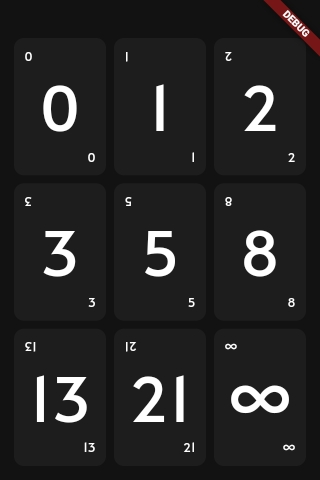
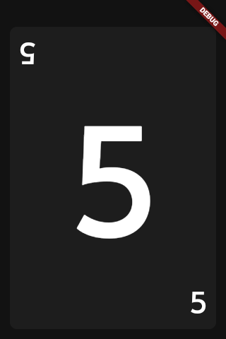
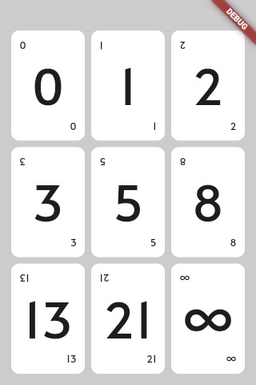
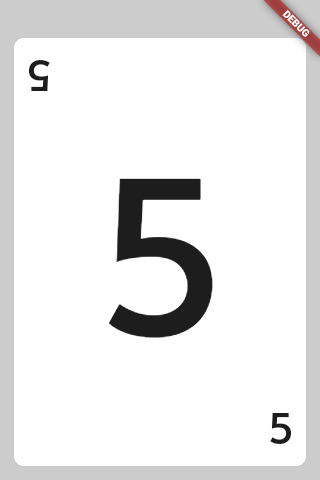

# Scrum Poker

Contains only Fibonacci numbers: "0", "1", "2", "3", "5", "8", "13", "21", "∞"

## Try now!

Android: [Play Store](https://play.google.com/store/apps/details?id=dev.afanasev.scrumpoker)

Web: [Github Pages](https://aafanasev.github.io/scrum-poker/)

iOS: N/A

## Screenshots

|Dark|    |Light|   |
|----|----|----|----|
|||||
